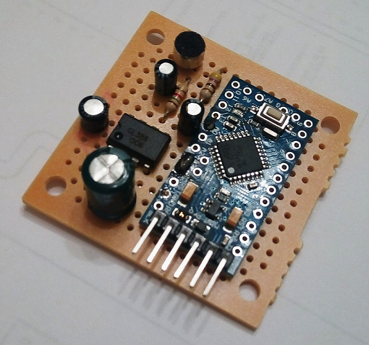
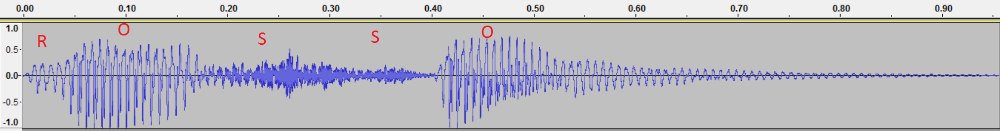
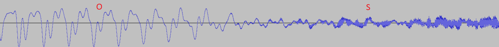
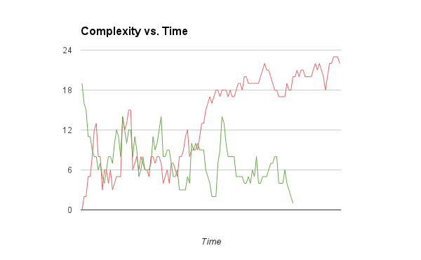
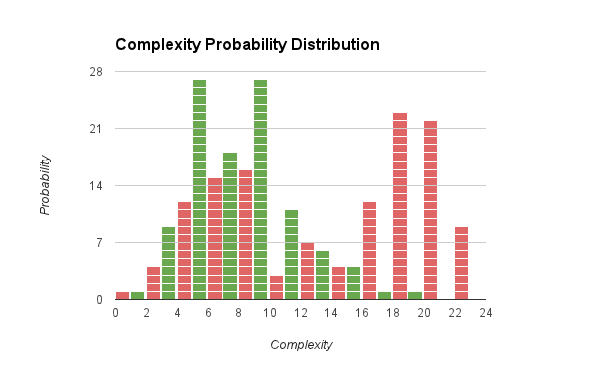

With this project I am exploring the possibility of recognizing speech with a low end microcontroller such as an ATmega-328. I am not expecting to recognize full sentences as this wouldn't be realistic with the hardware at hand.

I am hoping anyway to be able to at least recognize one of few words after the device has been trained with them. After all there is a very cheap chip, used in many toys alreay in the 90's, that is able to recognize few preset words, so there has to be a way to at least discern some words from others.

The hardware is a very simple board I used in many other my DSP projects, just an Arduino Nano with a microphone and a pre-amp.

You can see the current version in action here: https://www.youtube.com/watch?v=vhyUyqc152Q

Alghorithm
=============

As a first approach I have been starting from the observation that sounds like wovels have a lower complexity than other sounds and, in particular, fricative consonants. Fricatives are emitted passing air through an occlusion in the oral cavity and are very rich in harmonic content, while wovels are nearly pure tones. This idea is not completely new, similar work has been done in uSpeech (https://github.com/arjo129/uSpeech).

The current code takes some audio samples and calculates the complexity of the signal defined as:

-s(t-1)%5Cright%20%7C%7D%7B%5Cfrac%7B%5Csum_%7Bt%3D0%7D%5E%7Bn%7Ds(t)%7D%7Bn%7D%7D)

The numerator expresses the total amount of change while the denominator expresses the average sample amplitude. Without this term the complexity result would depend on the amplitude of the signal. This is a very simple way to calculate complexity and doesn't keep into account many things. It's a startig point anyway.

With the above I have got clear distinction between wovels (with values of complexity well below 10) and fricatives (e.g. sh, ch) with values in the order of 40 to 50. There are also values in the middle but in now way they seem to be enough to actually recognize other letters. 

The graph below shows a overview of what the word "rosso" that I used for tests looks like in time domain. As you see the wowels have a much less change than the fricative consonant (the 's'):

This is the area between the "o" and the "s" and shows in greater detail the huge difference in complexity of the two phonemens:

My current assumption is that I will need to analyze different aspects and combine them. For instance signal amplitude envelope could help to identify plosives, but this is just speculation at this point.

With the above in mind I made a very simple first test in which I collect the fingerprint of two spoken words and then keep sampling and measure correlation of the current fingerprint and the two sampled ones assuming the spoken word is the one with the highest correlation. This works surprisingly quite well if the words are chosen wisely and, in particular, one should abound in wowels and the other in fricatives. So I made a test with "rosso" and "verde", two italian words for "red" and "green" as they were giving the best results. I am sure there are a couple of english words that work as well, but these came handy as I have red and green LEDs sitting in my drawer so I plan to make them flick with voice.

The graph below shows how the complexity evolves in time for my two reference words "rosso" (red line) and "verde" (green line). As you can see the complexity is noticebly higher towards the end of "rosso", this is due to the fricative "s". I suspect this alone makes up for most of the recognition ability.

Another dimension that could provide some insight and that I have not explored yet is the complexity probability distributon. As can be seen in the chart below the word "rosso" (red bars) has the distribution moved more towards the higher complexity compared to the word "verde" (green bars). This, again, is caused by the fricative given by the "ss" in the end of "rosso". 

The current algorithm has the following limitations:

* Depends heavily on fricatives as they are remarkably different than other phonemes
* Always picks the most probable of the two options, so will trigger even if you speak something completely different

To do in future, in random order and not pondered very much:

* Add a short IIR bandpass filter to isolate better voice and enhance SNR
* Change the current complexity filter to one with lower insertion delay
* Use Shannon to calculate better complexity

